

- [C 语言程序设计](https://hackmd.io/@sysprog/c-programming) 议题，如 [不定个参数的处理](https://en.wikibooks.org/wiki/C_Programming/stdarg.h)，[signal](https://en.wikibooks.org/wiki/C_Programming/signal.h)，[setjmp/longjmp](https://en.wikibooks.org/wiki/C_Programming/setjmp.h)
- 学习 [GNU/Linux 开发工具](https://hackmd.io/@sysprog/gnu-linux-dev):
  - [Cppcheck](https://cppcheck.sourceforge.io/): **静态** 程序分析工具，即无需运行程序就可以分析出程序潜在的问题，当然会有一定的误差，类似的工具有 [cargo-check](https://doc.rust-lang.org/cargo/commands/cargo-check.html)
  - [Valgrind](https://valgrind.org/): **动态** 程序分析工具，即需要将程序运行起来再进行分析，通常用于检测内存泄漏 ([memory leak](https://en.wikipedia.org/wiki/Memory_leak))
- 学习使用 Git 与 GitHub
- 树立一致且易于协作的程序开发规范
- 研究自动测试机制
- 接触 [Linux Programming INterface](http://man7.org/tlpi/)
- 理解电脑乱数原理、应用场景，和相关的验证
- 研究 Linux 核心链表的实作机制，及其高效的排序实作



<!--more-->

- 

## 改写自 CMU 计算机系统概论的作业

[lab0-c](https://github.com/sysprog21/lab0-c) 改写自 CMU 的 [15-213/15-513 Introduction to Computer Systems (ICS)](http://www.cs.cmu.edu/~213/index.html) 课程的 [C Programming Lab: Assessing Your C Programming Skills](https://www.cs.cmu.edu/afs/cs/academic/class/15213-s20/www/labs/cprogramminglab.pdf)，用于检验学生对于 C 语言程序设计认知。

- [x] [LeetCode 2095. Delete the Middle Node of a Linked List](https://leetcode.com/problems/delete-the-middle-node-of-a-linked-list/)
- [x] [LeetCode 82. Remove Duplicates from Sorted List II](https://leetcode.com/problems/remove-duplicates-from-sorted-list-ii/)
- [x] [LeetCode 24. Swap Nodes in Pairs](https://leetcode.com/problems/swap-nodes-in-pairs/)
- [x] [LeetCode 25. Reverse Nodes in k-Group](https://leetcode.com/problems/reverse-nodes-in-k-group/)
- [x] [LeetCode 2487. Remove Nodes From Linked List](https://leetcode.com/problems/remove-nodes-from-linked-list/) / [参考题解](https://leetcode.com/problems/remove-nodes-from-linked-list/solutions/4188092/simple-easy-cpp-solution-with-explanation/)
- [x] [LeetCode 23. Merge k Sorted Lists](https://leetcode.com/problems/merge-k-sorted-lists/)
- [x] [Linked List Sort](https://npes87184.github.io/2015-09-12-linkedListSort/)

### 数据结构

头文件 [list.h](https://github.com/sysprog21/lab0-c/blob/master/list.h) 依据 Linux 核心风格实作了相应的 linked list 常用操作的宏，这个文件对于本次实验很重要，需要仔细阅读并在实验过程中使用这些宏来简化程式码。

头文件 [queue.h](https://github.com/sysprog21/lab0-c/blob/master/queue.h) 里则定义了队列元素 element_t 和队列上下文 q_context_t 的结构。

- list_head
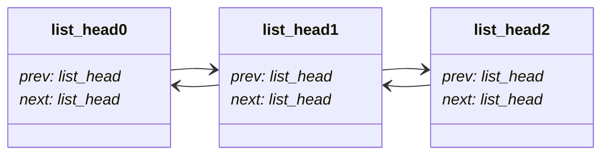

- element_t
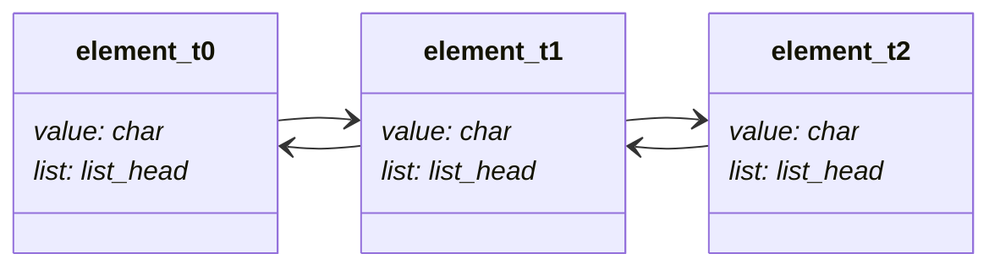

> 队列节点中的成员 `value` 指向的字符串也是动态分配的

- queue_context_t
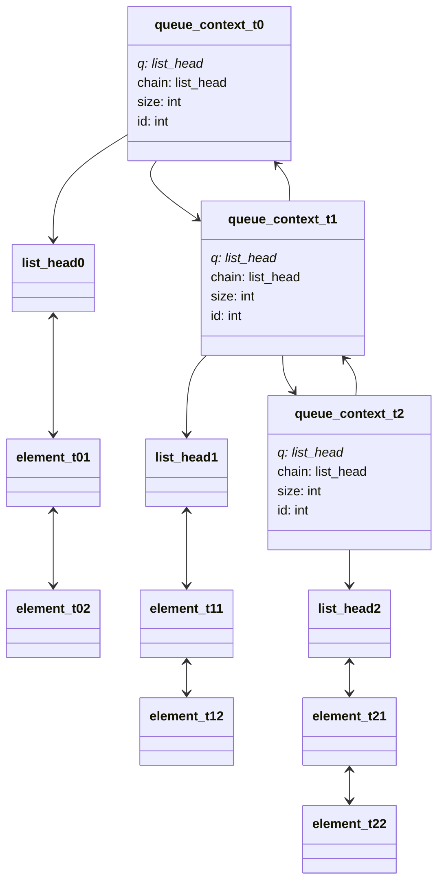

> `queue_context_t` 中的成员 `q` 的作用是指向将队列节点 `element_t` 连接起来的头节点，而成员 `chain` 的作用是将各个队列 `queue_context_t` 连接起来。

### q_size

```c
/**
 * q_size() - Get the size of the queue
 * @head: header of queue
 *
 * Return: the number of elements in queue, zero if queue is NULL or empty
 */
int q_size(struct list_head *head)
{
    if (!head)
        return 0;
    int len = 0;
    struct list_head *node;
    list_for_each (node, head)
        len++;
    return len;
}
```

### q_new

```c
/**
 * q_new() - Create an empty queue whose next and prev pointer point to itself
 *
 * Return: NULL for allocation failed
 */
struct list_head *q_new()
{
    struct list_head *head = malloc(sizeof(struct list_head));
    if (!head)
        return NULL;
    INIT_LIST_HEAD(head);
    return head;
}
```

### q_free

```c
/**
 * q_free() - Free all storage used by queue, no effect if header is NULL
 * @head: header of queue
 */
void q_free(struct list_head *l)
{
    struct list_head *head = l, *node, *safe;
    if (!head)
        return;
    list_for_each_safe (node, safe, head) {
        list_del(node);
        element_t *elem = list_entry(node, element_t, list);
        q_release_element(elem);
    }
    free(head);
}
```

这里使用 `list_for_each_safe` 而不是 `list_for_each_entry_safe` 来遍历链表，可以根据这两个宏的定义，以及思考链表只有一个元素时的情况。可以发现 `list_for_each_entry_safe` 认为 `list_head` 都被包裹在 `entry` 中，但是 `q_free` 的参数链表头节点 `l` 可能并没有被包裹在 `entry` 中，考虑到这种情况所以使用 `list_for_each_safe` 宏。最后需要释放头节点的空间，因为这个空间是在 `q_new` 时动态分配的。

### q_insert

```c
/**
 * q_insert_head() - Insert an element in the head
 * @head: header of queue
 * @s: string would be inserted
 *
 * Argument s points to the string to be stored.
 * The function must explicitly allocate space and copy the string into it.
 *
 * Return: true for success, false for allocation failed or queue is NULL
 */
bool q_insert_head(struct list_head *head, char *s)
{
    if (!head)
        return false;
    element_t *elem = malloc(sizeof(element_t));
    if (!elem)
        return false;
    elem->value = strdup(s);
    if (!elem->value) {
        free(elem);
        return false;
    }
    list_add(&elem->list, head);
    return true;
}
```

使用 `strdup` 进行动态分配空间并拷贝字符串的内容，可从 harness[.h][.c] 文件 (因为该部分是负责定制化本实验的动态分配功能) 中获得启发，该函数具体用法可以参考 `man strdup`。因为 `strdup` 本质上也是调用了 `malloc` 动态分配 (具体见 harness.c 中的 `test_strdup` 定义)，所以也需要对 `stdup` 的返回值判断动态分配释是否成功。

`q_insert_tail` 的实现类似，只需使用 `list_add_tail` 即可:

```c
/**
 * q_insert_tail() - Insert an element at the tail
 * @head: header of queue
 * @s: string would be inserted
 *
 * Argument s points to the string to be stored.
 * The function must explicitly allocate space and copy the string into it.
 *
 * Return: true for success, false for allocation failed or queue is NULL
 */
/* Insert an element at tail of queue */
bool q_insert_tail(struct list_head *head, char *s)
{
    if (!head)
        return false;
    element_t *elem = malloc(sizeof(element_t));
    if (!elem)
        return false;
    elem->value = strdup(s);
    if (!elem->value) {
        free(elem);
        return false;
    }
    list_add_tail(&elem->list, head);
    return true;
}
```

### q_remove

```c
/**
 * q_remove_head() - Remove the element from head of queue
 * @head: header of queue
 * @sp: string would be inserted
 * @bufsize: size of the string
 *
 * If sp is non-NULL and an element is removed, copy the removed string to *sp
 * (up to a maximum of bufsize-1 characters, plus a null terminator.)
 *
 * NOTE: "remove" is different from "delete"
 * The space used by the list element and the string should not be freed.
 * The only thing "remove" need to do is unlink it.
 *
 * Reference:
 * https://english.stackexchange.com/questions/52508/difference-between-delete-and-remove
 *
 * Return: the pointer to element, %NULL if queue is NULL or empty.
 */
element_t *q_remove_head(struct list_head *head, char *sp, size_t bufsize)
{
    if (!head || list_empty(head))
        return NULL;
    element_t *elem = list_first_entry(head, element_t, list);
    list_del_init(&elem->list);
    if (sp) {
        memcpy(sp, elem->value, bufsize - 1);
        sp[bufsize - 1] = '\0';
    }
    return elem;
}
```

使用 `list_first_entry` 来获取队列的头元素，同理可以使用 `list_last_entry` 来获取队列的尾元素:

```c
/**
 * q_remove_tail() - Remove the element from tail of queue
 * @head: header of queue
 * @sp: string would be inserted
 * @bufsize: size of the string
 *
 * Return: the pointer to element, %NULL if queue is NULL or empty.
 */
element_t *q_remove_tail(struct list_head *head, char *sp, size_t bufsize)
{
    if (!head || list_empty(head))
        return NULL;
    element_t *elem = list_last_entry(head, element_t, list);
    list_del_init(&elem->list);
    if (sp) {
        memcpy(sp, elem->value, bufsize - 1);
        sp[bufsize - 1] = '\0';
    }
    return elem;
}
```

### q_delete_mid

```c
/**
 * q_delete_mid() - Delete the middle node in queue
 * @head: header of queue
 *
 * The middle node of a linked list of size n is the
 * ⌊n / 2⌋th node from the start using 0-based indexing.
 * If there're six elements, the third member should be returned.
 *
 * Reference:
 * https://leetcode.com/problems/delete-the-middle-node-of-a-linked-list/
 *
 * Return: true for success, false if list is NULL or empty.
 */
bool q_delete_mid(struct list_head *head)
{
    // https://leetcode.com/problems/delete-the-middle-node-of-a-linked-list/
    if (!head || list_empty(head))
        return false;
    struct list_head *p = head->next;
    struct list_head *q = head->prev;
    while (!(p == q || p->next == q)) {
        p = p->next;
        q = q->prev;
    }
    list_del_init(q);
    element_t *elem = list_entry(q, element_t, list);
    q_release_element(elem);
    return true;
}
```

使用双指针分别从队列的首尾进行迭代，从而获取中间节点。注意需要先对获取的中间节点进行移除 remove 在进行释放 free。

### q_delete_dup

```c
/**
 * q_delete_dup() - Delete all nodes that have duplicate string,
 *                  leaving only distinct strings from the original queue.
 * @head: header of queue
 *
 * Reference:
 * https://leetcode.com/problems/remove-duplicates-from-sorted-list-ii/
 *
 * Return: true for success, false if list is NULL.
 */
bool q_delete_dup(struct list_head *head)
{
    // https://leetcode.com/problems/remove-duplicates-from-sorted-list-ii/
    if (!head)
        return false;
    struct list_head *node, *safe, *temp;
    list_for_each_safe (node, safe, head) {
        element_t *e_node = list_entry(node, element_t, list);
        while (!(safe == head)) {
            element_t *e_safe = list_entry(safe, element_t, list);
            if (strcmp(e_node->value, e_safe->value))
                break;
            safe = safe->next;
            list_del(&e_safe->list);
            q_release_element(e_safe);
        }
        if (temp != safe) {
            list_del(node);
            q_release_element(e_node);
        }
    }
    return true;
}
```

在有序队列中，对队列的每个元素进行迭代检查，需要额外注意 `safe == head` 的情形，否则使用 `list_entry` 可能会导致未定义行为 UB。需要注意保留下来的节点搜独特 (distinct) 的节点，即凡是出现重复的节点都需要被全部删除掉，而不是删除到仅剩一个。

### q_swap

```c
/**
 * q_swap() - Swap every two adjacent nodes
 * @head: header of queue
 *
 * Reference:
 * https://leetcode.com/problems/swap-nodes-in-pairs/
 */
void q_swap(struct list_head *head)
{
    // https://leetcode.com/problems/swap-nodes-in-pairs/
    if (!head)
        return;
    struct list_head *node, *safe, *prev, *next;
    list_for_each_safe (node, safe, head) {
        if (safe == head)
            break;
        prev = node->prev;
        next = safe->next;
        node->prev = safe;
        safe->next = node;

        node->next = next;
        safe->prev = prev;
        prev->next = safe;
        next->prev = node;

        safe = next;
    }
}
```

以两个节点为单位进行交换操作，然后与锚点设定相应的关系，依次逐个单位 (两个节点) 进行处理:

- before swap
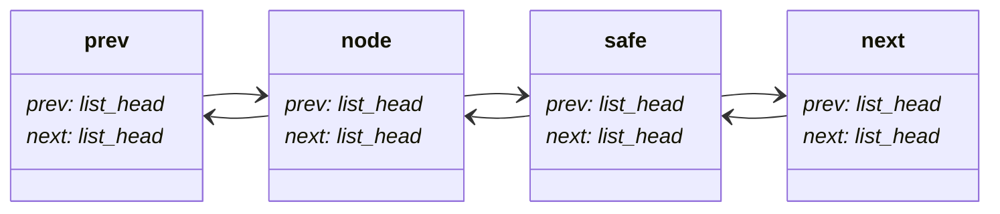

- after swap
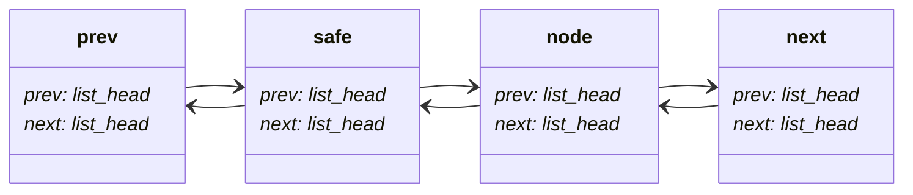

### q_reverse

```c
/**
 * q_reverse() - Reverse elements in queue
 * @head: header of queue
 *
 * No effect if queue is NULL or empty.
 * This function should not allocate or free any list elements
 * (e.g., by calling q_insert_head, q_insert_tail, or q_remove_head).
 * It should rearrange the existing ones.
 */
void q_reverse(struct list_head *head)
{
    if (!head)
        return;
    struct list_head *node, *safe, *prev;
    list_for_each_safe (node, safe, head) {
        prev = node->prev;
        node->prev = safe;
        node->next = prev;
    }
    prev = head->prev;
    head->prev = head->next;
    head->next = prev;
}
```

对队列的每个节点依次进行如下节点 `list_head 1` 的处理，即反转指针 `prev` 和 `next` 的指向 (实心箭头表示的是 `list_head 1` 的指针成员):

- before reverse
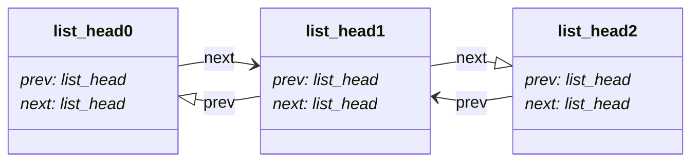

- after reverse
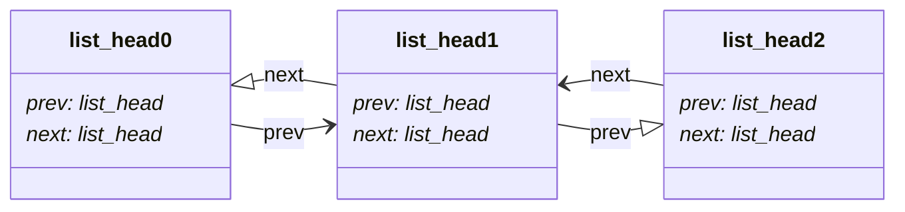

至于队列头节点 `head` 则不需要特别考虑，最后将其的 `prev` 和 `next` 成员的指向进行反转即可。

### q_reverseK

```c
/**
 * q_reverseK() - Given the head of a linked list, reverse the nodes of the list
 * k at a time.
 * @head: header of queue
 * @k: is a positive integer and is less than or equal to the length of the
 * linked list.
 *
 * No effect if queue is NULL or empty. If there has only one element, do
 * nothing.
 *
 * Reference:
 * https://leetcode.com/problems/reverse-nodes-in-k-group/
 */
void q_reverseK(struct list_head *head, int k)
{
    // https://leetcode.com/problems/reverse-nodes-in-k-group/
    if (!head)
        return;
    struct list_head *node, *safe, *prev, *next;
    list_for_each_safe (node, safe, head) {
        // get prev and next nodes around K nodes
        prev = node->prev;
        next = node;
        int cnt = 0;
        while (cnt < k && next != head) {
            cnt++;
            next = next->next;
        }
        if (cnt < k)
            break;
        safe = next->prev;

        // reverse K nodes
        struct list_head *p = node, *q;
        while (p != next) {
            q = p->next;
            p->next = p->prev;
            p->prev = q;

            p = q;
        }

        // setup node, safe, prev, next
        node->next = next;
        next->prev = node;
        safe->prev = prev;
        prev->next = safe;

        safe = next;
    }
}
```

`q_reverseK` 相当于 `q_swap` 的增强版，解决的思路也是比较类似，先确认 K 个节点的反转区域以及相应的前后锚点: `prev` 和 `next`，接下来对反转区域的 K 个节点进行反转，这部分的操作和 `q_reverse` 相同，都是逐个节点进行成员指针反转，反转结束后，和 `q_swap` 类似，设定与锚点相应的位置关系，依次逐区域 (K 个节点) 进行处理。该过程图示如下:

> 注意观察指针 `prev`, `next` 的变化

- before reverse
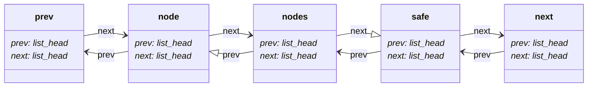

- after reverse
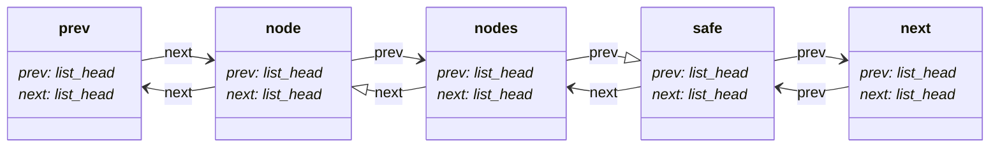

- after setup `prev`, `node`, `safe`, `next`
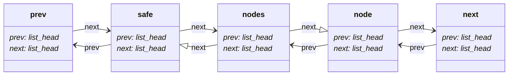

### q_sort

- [Linked List Sort](https://npes87184.github.io/2015-09-12-linkedListSort/)

```c
/**
 * q_sort() - Sort elements of queue in ascending/descending order
 * @head: header of queue
 * @descend: whether or not to sort in descending order
 *
 * No effect if queue is NULL or empty. If there has only one element, do
 * nothing.
 */ 
void q_sort(struct list_head *head, bool descend);
```

#### Bubble sort

主要是通过交换 (swap) 来实现核心的冒泡，思路是将节点 `safe` 对应字符串与 `node` 对应的字符串比较，从而决定是否进行交换操作，这里实现的是 stable 的排序算法，所以比较、交换时不考虑相等的情况。需要的是注意，虽然 swap 部分和 `q_swap` 几乎一样，但是最后设定下一个节点 `safe` 时不相同，因为这里需要每个节点之间都需要进行比较，而不是以每两个节点为单位进行交换。

布尔表达式 `(descend && cmp < 0) || (!descend && cmp > 0)` 表示不满足预期的 `node -> safe` 的顺序关系，需要调整成 `safe node` 顺序才满足。

```c
static void q_bubble_sort(struct list_head *head, bool descend)
{
    if (!head)
        return;

    bool swapped = true;
    struct list_head *node, *safe, *prev, *next;

    while (swapped) {
        swapped = false;
        list_for_each_safe (node, safe, head) {
            if (safe == head)
                break;

            element_t *e_node = list_entry(node, element_t, list);
            element_t *e_safe = list_entry(safe, element_t, list);

            int cmp = strcmp(e_node->value, e_safe->value);
            if ((descend && cmp < 0) || (!descend && cmp > 0)) {
                swapped = true;

                // swap
                prev = node->prev;
                next = safe->next;
                node->prev = safe;
                safe->next = node;

                node->next = next;
                safe->prev = prev;
                prev->next = safe;
                next->prev = node;

                // set next node
                safe = node;
            }
        }
    }
}
```

#### Insertion sort

核心是通过插入 (insertion) 操作，在左边已排序的节点中寻找合适的位置进行插入，链表的任意位置插入操作是比较直观的，移除后在对应的位置通过锚点插入固定。

```c
static void q_insertion_sort(struct list_head *head, bool descend)
{
    if (!head)
        return;

    struct list_head *node, *safe;
    list_for_each_safe (node, safe, head) {
        struct list_head *prev = node->prev, *next;
        // one node is already sorted
        if (prev == head)
            continue;

        // remove
        list_del(node);
        element_t *e_node = list_entry(node, element_t, list);
        element_t *e_prev = list_entry(prev, element_t, list);

        // find position
        int cmp = strcmp(e_prev->value, e_node->value);
        while ((descend && cmp < 0) || (!descend && cmp > 0)) {
            prev = prev->prev;
            if (prev == head)
                break;
            e_prev = list_entry(prev, element_t, list);
            cmp = strcmp(e_prev->value, e_node->value);
        }

        // insertion
        next = prev->next;
        prev->next = node;
        node->prev = prev;
        node->next = next;
        next->prev = node;
    }
}
```

#### Selection sort

这里采用的是 stable 的排序算法，所以并没有采用交换策略 (交换选择节点和当前节点)

```c
/* Selection sort */
static void q_selection_sort(struct list_head *head, bool descend)
{
    if (!head)
        return;

    struct list_head *node, *safe, *prev = head;
    list_for_each_safe (node, safe, head) {
        struct list_head *temp = node->next, *sele = node;

        // selection
        while (temp != head) {
            element_t *e_sele = list_entry(sele, element_t, list);
            element_t *e_temp = list_entry(temp, element_t, list);

            int cmp = strcmp(e_sele->value, e_temp->value);
            if ((descend && cmp < 0) || (!descend && cmp > 0)) {
                sele = temp;
            }
            temp = temp->next;
        }

        // insertion
        list_del(sele);
        prev->next->prev = sele;
        sele->next = prev->next;
        prev->next = sele;
        sele->prev = prev;

        // set next node
        prev = sele;
        safe = sele->next;
    }
}
```

#### Merge sort

将队列的双端链表视为普通的单链表，然后通过「快慢指针」来获取中间节点 (因为使用的是单链表，没法保证 `prev` 指向的正确性)，通过中间节点切分成两个普通的单链表，分别进行归并排序，最后进行单链表的归并操作。这里需要注意的是，过程中使用的单链表并不具备一个仅做为头节点使用的节点 (即 `q_new` 中分配的头节点)，并且使用的是 indirect pointer 作为参数，这样排序完成后 `head` 节点的 `next` 指向的就是正确顺序的链表，最后再根据该顺序补充 `prev` 关系即可。配合以下图示进行理解:

- origin queue
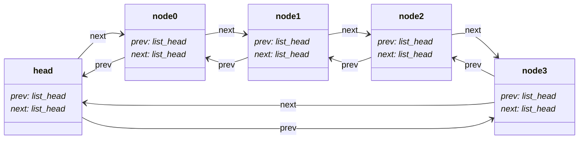

- convert to singly linked list
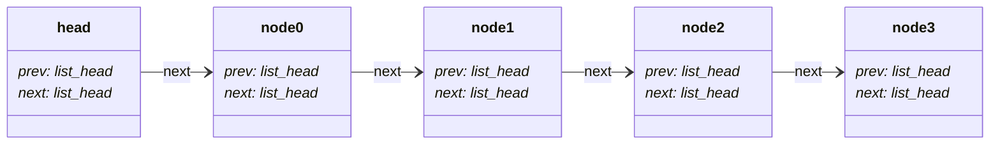

- split into two lists
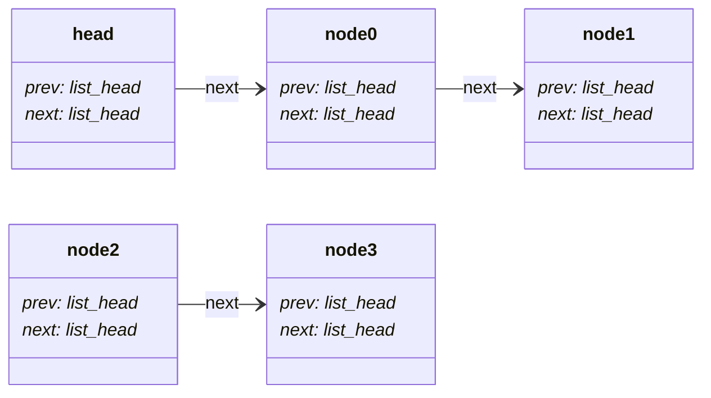

- indirect pointers
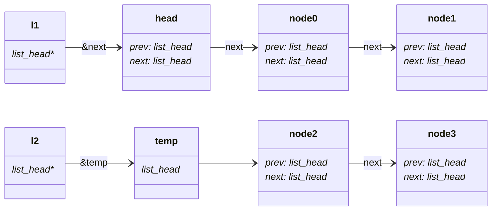

```c
/* Merge two linked list */
static void merge(struct list_head **l1,
                  struct list_head **const l2,
                  bool descend)
{
    struct list_head **temp = l1;
    struct list_head *node1 = *l1;
    struct list_head *node2 = *l2;

    while (node1 && node2) {
        element_t *elem1 = list_entry(node1, element_t, list);
        element_t *elem2 = list_entry(node2, element_t, list);

        int cmp = strcmp(elem1->value, elem2->value);
        if ((descend && cmp < 0) || (!descend && cmp > 0)) {
            *temp = node2;
            node2 = node2->next;
        } else {
            *temp = node1;
            node1 = node1->next;
        }
        temp = &(*temp)->next;
    }

    *temp = node1 ? node1 : node2;
}

/* Merge sort */
static void q_merge_sort(struct list_head **head, bool descend)
{
    if (!(*head) || !(*head)->next)
        return;

    // get the middle node by fast and slow pointers
    struct list_head *p = *head;
    struct list_head *q = (*head)->next;
    while (q && q->next) {
        p = p->next;
        q = q->next->next;
    }

    // set an additional list head
    struct list_head *l2 = p->next;
    p->next = NULL;

    q_merge_sort(head, descend);
    q_merge_sort(&l2, descend);
    merge(head, &l2, descend);
}

/* Sort elements of queue in ascending/descending order */
void q_sort(struct list_head *head, bool descend)
{
    if (!head)
        return;
    head->prev->next = NULL;
    q_merge_sort(&head->next, descend);
    struct list_head *node, *prev = head;
    for (node = head->next; node; node = node->next) {
        node->prev = prev;
        prev = node;
    }
    prev->next = head;
    head->prev = prev;
}
```

### q_ascend & q_descend

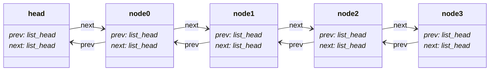

- ascend 结果的节点大小顺序: 
$$node 0 < node 1 < node 2 < node 3$$
- descend 结果的节点大小顺序: 
$$node 0 > node 1 > node 2 > node 3$$

依据这个特性，将链表进行反转后进行操作比较直观，参考 [这个题解](https://leetcode.com/problems/remove-nodes-from-linked-list/solutions/4188092/simple-easy-cpp-solution-with-explanation/)。需要注意的是，这里对节点的操作是删除 (delete) 而不只是移除 (remove)，所以记得移除 (remove) 之后及时释放 (free)。

```c
/**
 * q_ascend() - Remove every node which has a node with a strictly less
 * value anywhere to the right side of it.
 * @head: header of queue
 *
 * No effect if queue is NULL or empty. If there has only one element, do
 * nothing.
 *
 * Reference:
 * https://leetcode.com/problems/remove-nodes-from-linked-list/
 *
 * Return: the number of elements in queue after performing operation
 */
int q_ascend(struct list_head *head)
{
    // https://leetcode.com/problems/remove-nodes-from-linked-list/
    if (!head)
        return 0;
    q_reverse(head);
    struct list_head *node, *safe;
    list_for_each_safe (node, safe, head) {
        if (safe == head)
            break;
        element_t *e_node = list_entry(node, element_t, list);
        element_t *e_safe = list_entry(safe, element_t, list);
        while (strcmp(e_node->value, e_safe->value) < 0) {
            safe = safe->next;
            list_del(safe->prev);
            q_release_element(e_safe);
            if (safe == head)
                break;
            e_safe = list_entry(safe, element_t, list);
        }
    }
    q_reverse(head);
    return q_size(head);
}
```

```c
/**
 * q_descend() - Remove every node which has a node with a strictly greater
 * value anywhere to the right side of it.
 * @head: header of queue
 *
 * No effect if queue is NULL or empty. If there has only one element, do
 * nothing.
 *
 * Reference:
 * https://leetcode.com/problems/remove-nodes-from-linked-list/
 *
 * Return: the number of elements in queue after performing operation
 */
int q_descend(struct list_head *head)
{
    // https://leetcode.com/problems/remove-nodes-from-linked-list/
    if (!head)
        return 0;
    q_reverse(head);
    struct list_head *node, *safe;
    list_for_each_safe (node, safe, head) {
        if (safe == head)
            break;
        element_t *e_node = list_entry(node, element_t, list);
        element_t *e_safe = list_entry(safe, element_t, list);
        while (strcmp(e_node->value, e_safe->value) > 0) {
            safe = safe->next;
            list_del(safe->prev);
            q_release_element(e_safe);
            if (safe == head)
                break;
            e_safe = list_entry(safe, element_t, list);
        }
    }
    q_reverse(head);
    return q_size(head);
}
```

### q_merge

```c
/**
 * q_merge() - Merge all the queues into one sorted queue, which is in
 * ascending/descending order.
 * @head: header of chain
 * @descend: whether to merge queues sorted in descending order
 *
 * This function merge the second to the last queues in the chain into the first
 * queue. The queues are guaranteed to be sorted before this function is called.
 * No effect if there is only one queue in the chain. Allocation is disallowed
 * in this function. There is no need to free the 'qcontext_t' and its member
 * 'q' since they will be released externally. However, q_merge() is responsible
 * for making the queues to be NULL-queue, except the first one.
 *
 * Reference:
 * https://leetcode.com/problems/merge-k-sorted-lists/
 *
 * Return: the number of elements in queue after merging
 */
```

采用归并思想进行排序，时间复杂度为 $O(m \cdot logn)$。合并时需要注意将不需要的队列的 `q` 成员置为 init 姿态，即表示空队列。

```c
/* Merge two lists */
static void q_merge2(struct list_head *l1, struct list_head *l2, bool descend)
{
    queue_contex_t *q1 = list_entry(l1, queue_contex_t, chain);
    queue_contex_t *q2 = list_entry(l2, queue_contex_t, chain);
    struct list_head *h1 = q1->q->next;
    struct list_head *h2 = q2->q->next;
    struct list_head **head = &q1->q;

    while (h1 != q1->q && h2 != q2->q) {
        element_t *e1 = list_entry(h1, element_t, list);
        element_t *e2 = list_entry(h2, element_t, list);

        int cmp = strcmp(e1->value, e2->value);
        if ((descend && cmp < 0) || (!descend && cmp > 0)) {
            (*head)->next = h2;
            h2->prev = (*head);
            h2 = h2->next;
        } else {
            (*head)->next = h1;
            h1->prev = (*head);
            h1 = h1->next;
        }
        head = &(*head)->next;
    }

    if (h1 != q1->q) {
        (*head)->next = h1;
        h1->prev = (*head);
        head = &q1->q->prev;
    }
    if (h2 != q2->q) {
        (*head)->next = h2;
        h2->prev = (*head);
        head = &q2->q->prev;
    }

    (*head)->next = q1->q;
    q1->q->prev = (*head);
    INIT_LIST_HEAD(q2->q);
    q1->size += q2->size;

    return;
}

/* Merge lists in region [lh, rh) */
static void q_mergeK(struct list_head *lh, struct list_head *rh, bool descend)
{
    if (lh == rh || lh->next == rh)
        return;
    // get middle node by two pointers
    struct list_head *p = lh;
    struct list_head *q = rh->prev;
    while (!(p == q || p->next == q)) {
        p = p->next;
        q = q->prev;
    }
    q_mergeK(lh, q, descend);
    q_mergeK(q, rh, descend);
    q_merge2(lh, q, descend);
}

/* Merge all the queues into one sorted queue, which is in
 * ascending/descending order */
int q_merge(struct list_head *head, bool descend)
{
    // https://leetcode.com/problems/merge-k-sorted-lists/
    if (!head || list_empty(head))
        return 0;
    q_mergeK(head->next, head, descend);
    return list_entry(head->next, queue_contex_t, chain)->size;
}
```

### 命令行参数

关于 [lab0-c](https://github.com/sysprog21/lab0-c) 相关命令的使用，可以参照阅读后面的「取得程式码并进行开发」部分。

```bash
$ ./qtest
cmd> help
Commands:
  #           ...          | Display comment
  dedup                    | Delete all nodes that have duplicate string
  descend                  | Remove every node which has a node with a strictly greater value anywhere to the right side of it
  dm                       | Delete middle node in queue
  free                     | Delete queue
  help                     | Show summary
  ...
```


- [Difference between "delete" and "remove"](https://english.stackexchange.com/questions/52508/difference-between-delete-and-remove)

Delete and remove are defined quite similarly, but the main difference between them is that delete means erase (i.e. rendered nonexistent or nonrecoverable), while remove connotes take away and set aside (but kept in existence).

In your example, if the item is existent after the removal, just say remove, but if it ceases to exist, say delete.


在完成 queue.c 文件中的函数功能时，可以通过使用这个命令行对参数对应的功能进行测试，例如:

```bash
# test q_size
> new
L = []
> ih a
L = [a]
> ih b
L = [b a]
> size
2
```

## 开发环境设定

```bash
$ neofetch --stdout
cai@cai-RB-14II 
--------------- 
OS: Ubuntu 22.04.4 LTS x86_64 
Host: RedmiBook 14 II 
Kernel: 6.5.0-35-generic 
Uptime: 1 hour, 10 mins 
Packages: 2047 (dpkg), 11 (snap) 
Shell: bash 5.1.16 
Resolution: 1920x1080 
DE: GNOME 42.9 
WM: Mutter 
WM Theme: Adwaita 
Theme: Yaru-blue-dark [GTK2/3] 
Icons: Yaru-blue [GTK2/3] 
Terminal: gnome-terminal 
CPU: Intel i7-1065G7 (8) @ 3.900GHz 
GPU: NVIDIA GeForce MX350 
GPU: Intel Iris Plus Graphics G7 
Memory: 3462MiB / 15776MiB 
```

安装必要的开发工具包:
```bash
$ sudo apt install build-essential git-core valgrind
$ sudo apt install cppcheck clang-format aspell colordiff
```

基本的 Linux 命令行操作，可参考 [鸟哥的 Linux 私房菜的](https://linux.vbird.org/) 相关章节:
- [Linux 的檔案權限與目錄配置](https://linux.vbird.org/linux_basic/centos7/0210filepermission.php)
- [Linux 檔案與目錄管理](https://linux.vbird.org/linux_basic/centos7/0220filemanager.php)
- [檔案與檔案系統的壓縮、打包與備份](https://linux.vbird.org/linux_basic/centos7/0240tarcompress.php)


"If I had eight hours to chop down a tree, I’d spend six hours sharpening my axe." – Abraham Lincoln

「工欲善其事，必先利其器」


## 取得程式码并进行开发

建立开发目录:
```bash
$ cd ~
$ mkdir -p linux2023
```

从 GItHub 获取 [lab-c] 程式码:
```bash
$ git clone git@github.com:<username>/lab0-c
# or
$ git clone https://github.com/<username>/lab0-c
```

切换的 `lab0-c` 目录并进行编译:
```bash
$ cd lab0-c
$ make
```

预期看到以下输出:
```bash
  CC	qtest.o
  CC	report.o
  CC	console.o
  CC	harness.o
  CC	queue.o
  CC	random.o
  CC	dudect/constant.o
  CC	dudect/fixture.o
  CC	dudect/ttest.o
  CC	shannon_entropy.o
  CC	linenoise.o
  CC	web.o
  LD	qtest
```

也可以清除编译输出的档案 (一般是可执行文件和目标文件):
```bash
$ make clean
```

可以通过以下命令设定编译时输出的细节：
```bash
$ make VERBOSE=1
```

这样编译时会输出更多细节:
```bash
$ make
gcc -o qtest.o -O1 -g -Wall -Werror -c -MMD -MF .qtest.o.d qtest.c
gcc -o report.o -O1 -g -Wall -Werror -c -MMD -MF .report.o.d report.c
gcc -o console.o -O1 -g -Wall -Werror -c -MMD -MF .console.o.d console.c
gcc -o harness.o -O1 -g -Wall -Werror -c -MMD -MF .harness.o.d harness.c
gcc -o queue.o -O1 -g -Wall -Werror -c -MMD -MF .queue.o.d queue.c
gcc -o qtest qtest.o report.o console.o harness.o queue.o
```

即最终的执行档案为 `qtest`。接下来可以通过以下命令来测试 `qtest`:
```bash
$ make check
./qtest -v 3 -f traces/trace-eg.cmd
cmd> 
cmd> # Demonstration of queue testing framework
cmd> # Use help command to see list of commands and options
cmd> # Initial queue is NULL.
cmd> show
q = NULL
cmd> # Create empty queue
cmd> new
q = []
cmd> # Fill it with some values.  First at the head
cmd> ih dolphin
```

即将 [traces/trace-eg.cmd](https://github.com/sysprog21/lab0-c/blob/master/traces/trace-eg.cmd) 的内容作为测试命令指派给 `qtest` 执行。

由输出可以得知命令 `make check` 只是对一些基本功能进行测试，可以通过以下命令进行全面覆盖的测试:
```bash
$ make test
```

这个命令也是本次实验的自动评分系统，其实际执行了 [scripts/driver.py](https://github.com/sysprog21/lab0-c/blob/master/scripts/driver.py) 这个 Python 程序，这个程序的基本逻辑就是将 traces/trace-XX-CAT.cmd 这类内容作为测试命令指派给 `qtest` 内部的命令解释器进行执行，并依据测试结果计算相应的分数。

通过以下命令会开启 [AddressSanitizer](https://github.com/google/sanitizers/wiki/AddressSanitizer) 从而强化执行时期的内存检测，在进行测试时会输出相应的内存检测信息:
```bash
$ make SANITIZER=1
$ make test
# the following output as an example
==8522==ERROR: AddressSanitizer: SEGV on unknown address 0x000000000008 (pc 0x55ea517092cb bp 0x7ffe778b4900 sp 0x7ffe778b4900 T0)
==8522==The signal is caused by a READ memory access.
==8522==Hint: address points to the zero page.
    #0 0x55ea517092ca in q_remove_head lab0-c/queue.c:74
    #1 0x55ea51704880 in do_remove_head lab0-c/qtest.c:311
    #2 0x55ea51707054 in interpret_cmda lab0-c/console.c:217
    #3 0x55ea51707a58 in interpret_cmd lab0-c/console.c:240
    #4 0x55ea51708725 in cmd_select lab0-c/console.c:568
    #5 0x55ea51708b42 in run_console lab0-c/console.c:627
    #6 0x55ea51705c7d in main lab0-c/qtest.c:700
    #7 0x7facce0d8b96 in __libc_start_main (/lib/x86_64-linux-gnu/libc.so.6+0x21b96)
    #8 0x55ea51703819 in _start (lab0-c/qtest+0x5819)
```

- [Address/Thread/Memory Sanitizer](https://www.slideshare.net/sermp/sanitizer-cppcon-russia)
- [A look into the sanitizer family (ASAN & UBSAN) by Akul Pillai](https://www.slideshare.net/slideshow/a-look-into-the-sanitizer-family-asan-ubsan-by-akul-pillai/135506952)

### clang-format 工具和一致的程序撰写风格

需要在当前目录或指定路径有 `.clang-format` 文件，然后通过以下使用方式:
```bash
$ clang-format -i *.[ch]
```

> 相关程序风格查看原文即可

### Git Hooks 进行自动程式码排版检查

第一次 make 后，Git pre-commit / pre-push hook 将被自动安装到当前的工作区 (workspace)，之后每次执行 git commit 時，[Git hook](https://www.atlassian.com/git/tutorials/git-hooks) 都会检查 C/C++ 的代码风格是否与 `.clang-format` 要求的一致，并同时通过 [Cppcheck](http://cppcheck.sourceforge.net/) 进行静态程序分析检查。


tig 可以更加方便的浏览 git repository 的信息:
```bash
# install
$ sudo apt install tig
# read the manual
$ tig --help
# or if you have installed tldr
$ tldr tig
```


怎么写好一个 Git Commit:
- 英文原文: [How to Write a Git Commit Message](https://cbea.ms/git-commit/)
- 中文翻译: [如何寫一個 Git Commit Message](https://blog.louie.lu/2017/03/21/%E5%A6%82%E4%BD%95%E5%AF%AB%E4%B8%80%E5%80%8B-git-commit-message/)

The seven rules of a great Git commit message:
1. Separate subject from body with a blank line
2. Limit the subject line to 50 characters
3. Capitalize the subject line
4. Do not end the subject line with a period
5. Use the imperative mood in the subject line
6. Wrap the body at 72 characters
7. Use the body to explain what and why vs. how


請避免用 `$ git commit -m`，而是透過編輯器調整 git commit message。許多網路教學為了行文便利，用 `$ git commit -m` 示範，但這樣很容易讓人留下語焉不詳的訊息，未能提升為好的 Git Commit Message。因此，從今以後，不要用 `git commit -m`, 改用 `git commit -a` (或其他參數) 並詳細查驗變更的檔案。


设置 Git 的默认编辑器为 Vim:
```bash
$ git config --global core.editor vim
```

### GitHub Actions 设定

> GitHub Actions 是 GitHub 提供的 CI/CD 服務，CI/CD 代表的是 Continuous Integration 持續整合與 Continuous Deployment 持續部署，簡單來說就是將程式流程自動化。lab0-c 提供幾項自動化測試，包含：檢查排版、編譯結果和自動評分等等。這裡需要注意的是 fork 完成後，預設情況下 GitHub Action 不會被啟動，所以需要 **手動開啟 GitHub Actions**，在你所 fork 出的 repository 的 Actions 內點選 `I understand my workflows, go ahead and enable them`

> 開啟 GitHub Actions 後，當每次 push 到遠端時，GitHub 就會自動測試作業設計的檢查項目，當有錯誤時會收到 CI failed 的 email 通知。

> 在現有的 GitHub Actions 對應的測試項目中，一旦收到 `git push` 的事件，系統就會自動執行 `make test`，並在失敗時發信件通知學員。

> 點擊信件中的 `View workflow run` 即可在 GitHub 網站中得知 GitHub Actions 的測試狀況。

## 以 Valgrind 分析内存问题

[Valgrind](https://valgrind.org/) is an instrumentation framework for building dynamic analysis tools. There are Valgrind tools that can automatically detect many memory management and threading bugs, and profile your programs in detail. You can also use Valgrind to build new tools.

使用方式:
```bash
$ valgrind --tool=<toolname> <program>
```

- [Valgrind is NOT a leak checker](http://maintainablecode.logdown.com/posts/245425-valgrind-is-not-a-leak-checker)
> Valgrind is an undefined behavior checking tool first, a function and memory profiler second, a data-race detection tool third, and a leak checking tool last.


dynamic Binary Instrumentation (DBI) 著重於二進位執行檔的追蹤與資訊彙整，而 dynamic Binary Analysis (DBA) 則強調對收集資訊的分析。上述 Valgrind 是個 DBI 系統框架，可建構一系列 DBA 工具，藉由 shadow values 技術來實作，後者要求對所有的暫存器和使用到的主記憶體做 shadow (即自行維護的副本)，這也使得 Valgrind 相較其他分析方法會較慢。



也就是說，[Valgrind](https://valgrind.org/) 主要的手法是將暫存器和主記憶體的內容自行維護副本，並在任何情況下都可以安全正確地使用，同時記錄程式的所有操作，在不影響程式執行結果前提下，輸出有用的資訊。為了實作功能，[Valgrind](https://valgrind.org/) 利用 [dynamic binary re-compilation](https://en.wikipedia.org/wiki/Dynamic_recompilation) 把測試程式 (稱為 client 程式) 的機械碼解析到 VEX 中間表示法 (intermediate representation，簡稱 IR，是種虛擬的指令集架構，規範在原始程式碼 [VEX/pub/libvex_ir.h](https://sourceware.org/git/?p=valgrind.git;a=blob;f=VEX/pub/libvex_ir.h))。VEX IR 在 [Valgrind](https://valgrind.org/) 採用執行導向的方式，以 just-in-time (JIT) 編譯技術動態地把機械碼轉為 IR，倘若觸發特定工具感興趣的事件 (如記憶體配置)，就會跳躍到對應的處理工具，後者會插入一些分析程式碼，再把這些程式碼轉換為機械碼，儲存到 code cache 中，以利後續需要時執行。

```
Machine Code --> IR --> IR --> Machine Code
        ^        ^      ^
        |        |      |
    translate    |      |
                 |      |
            instrument  |
                        |
                     translate  
```



Valgrind 启动后会对 client 程序进行转换，所以 Valgrind 执行的是加工后的 client 程序:
- 2007 年的论文: [Valgrind: A Framework for Heavyweight Dynamic Binary Instrumentation](https://valgrind.org/docs/valgrind2007.pdf)
- 繁体中文版本的 [论文导读](https://wdv4758h-notes.readthedocs.io/zh_TW/latest/valgrind/dynamic-binary-instrumentation.html)

### Valgrind 使用案例

安装调试工具以让 Valgrind 更好地进行分析:
```bash
$ sudo apt install libc6-dbg
```

#### Memory Leak

常见错误有: `malloc` 了一个空间但没 `free` 导致内存泄露

memory lost:
- definitely lost
- indirectly lost
- possibly lost
- still readchable

运行 valgrind 和 gdb 类似，都需要使用 `-g` 参数来编译 C/C++ 源程序以生成调试信息，然后还可以通过 `-q` 参数指示 valgrind 进入 quite 模式，减少启动时信息的输出。

```bash
$ valgrind -q --leak-check=full ./case1
```

- `--leak-check=full`: 启用全面的内存泄漏检查，valgrind 将会报告所有的内存泄漏情况，包括详细的堆栈跟踪信息
- `--show-possibly-lost=no`: 不输出 possibly lost 相关报告
- `--track-fds=yes`: 侦测 file descriptor 开了没关的情况

#### Invalid Memory Access

常见错误有: `malloc` 了并 `free` 但又对这个已经被 free 的空间进行操作，即 [Use After Free](https://cwe.mitre.org/data/definitions/416.html)

> valgrind 输出的报告 invalid write/read 这类的单位是 Byte，即 size of X (bytes)

#### Other

- `Conditional jump or move depends on uninitialised value(s)` 这个错误一般是因为使用了没有结束字符 (null-terminated string) 的字符串
- 不同函数使用了不合法的栈空间，例如函数 A 使用了已经返回了的函数 B 的栈空间，这样的操作是不合法的
- 对局部变量的存取超过范围会导致 `stack corrupt` (个人感觉等同 stack overflow)

程序运行时的内存布局:



Valgrind 配合 [Massif](https://valgrind.org/docs/manual/ms-manual.html) 可以对程序运行时的内存行为进行可视化:




- [Valgrind User Manual](https://valgrind.org/docs/manual/manual.html)
- [Massif: a heap profiler](https://valgrind.org/docs/manual/ms-manual.html)


lab0-c 也引入了 Valgrind 来协助侦测实验过程中可能出现的内存相关问题，例如 [memory leak](https://en.wikipedia.org/wiki/Memory_leak), [buffer overflow](https://en.wikipedia.org/wiki/Buffer_overflow), [Dangling pointer](https://en.wikipedia.org/wiki/Dangling_pointer) 等等。使用方式如下:
```bash
$ make valgrind
```

## 自动测试程序

- [signal](https://man7.org/linux/man-pages/man7/signal.7.html)
- 异常执行流

### 追踪内存的分配和释放

- [x] Wikipedia: [Hooking](https://en.wikipedia.org/wiki/Hooking)
- [x] Wikipedia: [Test harness](https://en.wikipedia.org/wiki/Test_harness)
- [x] GCC: [Arrays of Length Zero](https://gcc.gnu.org/onlinedocs/gcc/Zero-Length.html)
> The alignment of a zero-length array is the same as the alignment of its elements.




- [ ] [C Struct Hack - Structure with variable length array](https://frankchang0125.blogspot.com/2013/01/c-struct-hack-structure-with-variable.html)

相关源代码阅读 ([harness.h](https://github.com/sysprog21/lab0-c/blob/master/harness.h), [harness.c](https://github.com/sysprog21/lab0-c/blob/master/harness.c)):

```c
typedef struct __block_element {
    struct __block_element *next, *prev;
    size_t payload_size;
    size_t magic_header; /* Marker to see if block seems legitimate */
    unsigned char payload[0];
    /* Also place magic number at tail of every block */
} block_element_t;

/* Find header of block, given its payload.
 * Signal error if doesn't seem like legitimate block
 */
block_element_t *find_header(void *p);

/* Given pointer to block, find its footer */
size_t *find_footer(block_element_t *b);

/* Implementation of application functions */
void *test_malloc(size_t size);

// cppcheck-suppress unusedFunction
void *test_calloc(size_t nelem, size_t elsize);

void test_free(void *p);
```

### qtest 命令解释器

新增指令 hello，用于打印 `Hello, world"` 的信息。调用流程:
```
main → run_console → cmd_select → interpret_cmd → interpret_cmda → do_hello
```

相关源代码阅读 ([console.h](https://github.com/sysprog21/lab0-c/blob/master/console.h), [console.c](https://github.com/sysprog21/lab0-c/blob/master/console.c)):

```c
typedef struct __cmd_element {...} cmd_element_t;

/* Optionally supply function that gets invoked when parameter changes */
typedef void (*setter_func_t)(int oldval);

/* Integer-valued parameters */
typedef struct __param_element {...} param_element_t;

/* Initialize interpreter */
void init_cmd();

/* Add a new command */
void add_cmd(char *name, cmd_func_t operation, char *summary, char *parameter);
#define ADD_COMMAND(cmd, msg, param) add_cmd(#cmd, do_##cmd, msg, param)

/* Add a new parameter */
void add_param(char *name, int *valp, char *summary, setter_func_t setter);

/* Execute a command that has already been split into arguments */
static bool interpret_cmda(int argc, char *argv[])
```


原文的「命令直译器的初始化准备」部分，示例的代码片段与最新的代码有许多差别 (特别是结构体的名称)，一定要搭配阅读最新的源码，否则会十分迷糊。


### Signal 处理和应用

Linux manual page:

- [signal(2)](https://man7.org/linux/man-pages/man2/signal.2.html)
> signal() sets the disposition of the signal signum to handler, which is either SIG_IGN, SIG_DFL, or the address of a  programmer-defined  function (a "signal handler").

```c {title="qinit.c"}
static void q_init()
{
    fail_count = 0;
    INIT_LIST_HEAD(&chain.head);
    signal(SIGSEGV, sigsegv_handler);
    signal(SIGALRM, sigalrm_handler);
}
```

- [alarm(2)](https://man7.org/linux/man-pages/man2/alarm.2.html)
> alarm() arranges for a SIGALRM signal to be delivered to the calling process in seconds seconds. If seconds is zero, any pending alarm is canceled. In any event any previously set alarm() is canceled.

- [setjmp(3)](https://man7.org/linux/man-pages/man3/longjmp.3.html)
> The functions described on this page are used for performing
> "nonlocal gotos": transferring execution from one function to a
> predetermined location in another function.  The setjmp()
> function dynamically establishes the target to which control will
> later be transferred, and longjmp() performs the transfer of
> execution.

- [sigsetjmp(3)](https://linux.die.net/man/3/sigsetjmp)
> setjmp() and sigsetjmp() return 0 if returning directly, and nonzero when returning from longjmp(3) or siglongjmp(3) using the saved context.

Why use `sigsetjmp()`/`siglongjmp()` instead of `setjmp()`/`longjmp()`? 

- [The Linux Programming Interface](https://man7.org/tlpi/)

> The sa_mask field allows us to specify a set of signals that aren’t permitted to interrupt execution of this handler. In addition, the signal that caused the handler to be invoked is automatically added to the process signal mask. This means that a signal handler won’t recursively interrupt itself if a second instance of the same signal arrives while the handler is executing.

> However, there is a problem with using the standard longjmp() function to exit from a signal handler. We noted earlier that, upon entry to the signal handler, the kernel automatically adds the invoking signal, as well as any signals specified in the act.sa_mask field, to the process signal mask, and then removes these signals from the mask when the handler does a normal return.
> 
> What happens to the signal mask if we exit the signal handler using longjmp()? The answer depends on the genealogy of the particular UNIX implementation.


簡言之，當某個 signal handler 被觸發時，該 signal 會在執行 signal handler 時會被遮罩住，並在 signal handler 回傳時恢復。而，在裡面使用 longjmp 時，解除訊號遮罩的行為有可能不會發生(是否解除則依照實作決定)。為了保證在非區域跳躍後能夠恢復，所以 POSIX 另行規範得以在 signal handler 中呼叫的 `sigsetjmp` 跟 `siglongjmp`。


- `jmp_ready` 技巧 (用于保证在 `siglongjmp()` 之前必然执行过一次 `sigsetjmp()`):
> Because a signal can be generated at any time, it may actually occur before the target of the goto has been set up by sigsetjmp() (or setjmp()). To prevent this possibility (which would cause the handler to perform a nonlocal goto using an uninitialized env buffer), we employ a guard variable, canJump, to indicate whether the env buffer has been initialized. If canJump is false, then instead of doing a nonlocal goto, the handler simply returns.

在执行 `siglongjmp` 之前执行一次 `sigsetjmp` 是必须的，这用于保存 `sigsetjmp` 所处地方的上下文，而 `sigsetjmp` 所处地方正是 `siglongjmp` 执行时需要跳转到的地方，所以为了保证长跳转后执行符合预取，需要保存上下文。

```c
void trigger_exception(char *msg)
{
    ...
    if (jmp_ready)
        siglongjmp(env, 1);
    else
        exit(1);
}

bool exception_setup(bool limit_time)
{
    if (sigsetjmp(env, 1)) {
        /* Got here from longjmp */
        jmp_ready = false;
        ...
    } else {
        /* Got here from initial call */
        jmp_ready = true;
        ...
    }
}
```

相关源代码阅读 ([qtest.c](https://github.com/sysprog21/lab0-c/blob/master/qtest.c), [report.h](https://github.com/sysprog21/lab0-c/blob/master/report.h), [report.c](https://github.com/sysprog21/lab0-c/blob/master/report.c), [harness.h](https://github.com/sysprog21/lab0-c/blob/master/harness.h), [harness.c](https://github.com/sysprog21/lab0-c/blob/master/harness.c)):

```c
/* Signal handlers */
static void sigsegv_handler(int sig);
static void sigalrm_handler(int sig)

/* Use longjmp to return to most recent exception setup */
void trigger_exception(char *msg);

/* Prepare for a risky operation using setjmp.
 * Function returns true for initial return, false for error return
 */
bool exception_setup(bool limit_time);

void report_event(message_t msg, char *fmt, ...);
```

### 检测非预期的内存操作或程序执行超时

由上面可知，当收到 `SIGSEGV` 或 `SIGALRM` 信号时，会通过 `signal handler` :arrow_right: `trigger_exception` :arrow_right: `exception_setup` 这一条链路执行。那么当 `exception_setup` 函数返回时会跳转到哪里呢？

在 [qtest.c]() 的形如 `do_<operation>` 这类函数里面，都会直接或间接的包含以下的程式码:
```c
if (exception_setup(true)) {
    ...
}
exception_cancel();
```

> 回到稍早提及的 `if (exception_setup(true))` 敘述中，若是第一次回傳，那麼會開始測試函式。若測試函式的過程中，發生任何錯誤 (亦即觸發 `SIGSEGV` 或 SIGALRM 一類的 `signal`)，就會立刻跳回 signal handler。signal handler 會印出錯誤訊息，並進行 `siglongjmp`。由 `exception_setup` 的程式可以知道又是跳到 `exception_setup(true)` 裡面，但這時會回傳 `false`，因而跳過測試函式，直接結束測試並回傳 `ok` 內含值。換言之，`exception_cancel()` 後就算再發生 `SIGALRM` 或 `SIGSEGV`，也不會再有機會回到 exception_setup() 裡面。

## 整合网页服务器

### 整合 tiny-web-server

- [tiny-web-server](https://github.com/7890/tiny-web-server)


原文的示例的代码片段与最新的代码有许多差别 (特别是函数的名称)，一定要搭配阅读最新的源码，否则会十分迷糊。


程序等待输入的调用链 ([linenoise.c](https://github.com/sysprog21/lab0-c/blob/master/linenoise.c)):
```
linenoise() -> line_raw() -> line_edit()
```

但 `line_edit` 中是使用 `read` 等待用户输入，所以当 `read` 阻塞时就无法接收来自 web 传来的信息。尝试使用 `select()` 来同时处理标准输入 `stdin` 和网络 `socket`。

- [select(2)](https://man7.org/linux/man-pages/man2/select.2.html)
> On success, select() and pselect() return the number of file
> descriptors contained in the three returned descriptor sets (that
> is, the total number of bits that are set in readfds, writefds,
> exceptfds).  The return value may be zero if the timeout expired
> before any file descriptors became ready.
> 
> On error, -1 is returned, and errno is set to indicate the error;
> the file descriptor sets are unmodified, and timeout becomes
> undefined.



`select` 和 `poll` 都是上图所示的多路 I/O 复用的模型，优势在于可以同时处理多个 file descriptor，但缺点在于需要使用 2 次 syscall，第一次是等待 kernel 发出通知，第二次是从 kernel 拷贝数据，每次 syscall 都需要进行 context switch，导致这个模型比其他的 I/O 模型开销大 (context switch 开销是很大的)。

相关源代码阅读 ([linenoise.h](https://github.com/sysprog21/lab0-c/blob/master/linenoise.h), [linenoise.c](https://github.com/sysprog21/lab0-c/blob/master/linenoise.c), [console.c](https://github.com/sysprog21/lab0-c/blob/master/console.c)):

## 在 qtest 提供新命令 shuffle
