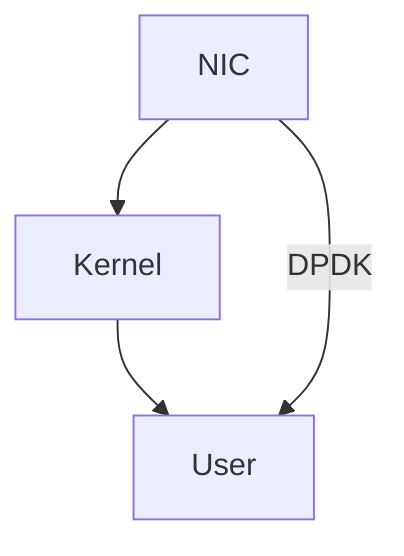

# Linux 核心设计: 发展动态回顾


> 本講座將以 Thorsten Leemhuis 在 FOSDEM 2020 開場演說 "Linux kernel – Solving big problems in small steps for more than 20 years" (slides) 為主軸，嘗試歸納自 21 世紀第一年開始的 Linux 核心 2.4 版到如今的 5.x 版，中間核心開發者如何克服 SMP (Symmetric multiprocessing), scalability, 及各式硬體架構和周邊裝置支援等難題，過程中提出全面移除 BKL (Big kernel lock)、實作虛擬化技術 (如 Xen 和 KVM)、提出 namespace 和 cgroups 從而確立容器化 (container) 的能力，再來是核心發展的明星技術 eBPF 會在既有的基礎之上，帶來 XDP 和哪些令人驚豔的機制呢？又，Linux 核心終於正式納入發展十餘年的 PREEMPT_RT，使得 Linux 核心得以成為硬即時的作業系統，對內部設計有哪些衝擊？AIO 後繼的 io_uring 讓 Linux 有更優雅且高效的非同步 I/O 存取，我們該如何看待？

<!--more-->

- 

## 开篇点题

> 前置知识: [Linux 核心设计: 操作系统术语及概念](https://hackmd.io/@sysprog/linux-concepts)

FOSDEM 2020, T. Leemhuis:
- YouTube: [Linux kernel – Solving big problems in small steps for more than 20 years](https://www.youtube.com/watch?v=WsktXXMOg1k)
- [slides](https://archive.fosdem.org/2020/schedule/event/linux_kernel/attachments/slides/3890/export/events/attachments/linux_kernel/slides/3890/Fosdem_Leemhuis_Kernel_Steps.pdf) (这个投影片共有 248 页，所以加载时可能会比较慢 :rofl:)

以上面的讲座为主轴，回顾 Linux 的发展动态，由此展望 Linux 未来的发展方向。
- SMP (Symmetric multiprocessing)
- scalability
- BKL (Big kernel lock)
- Xen, KVM
- namespace, cgroups, container - *云服务*
- eBPF, XDP - *网络封包的高效过滤 (在内核即可处理封包的过滤，无需在用户态制定规则)*
- PREEMPT_RT - *硬即时操作系统 ([hard real time os](https://www.suse.com/c/what-is-a-real-time-operating-system/#:~:text=Hard%20Real%2DTime%20Operating%20Systems,in%20time%20could%20be%20catastrophic.))*
- io_uring - *高效的非同步 I/O (Linux 大部分系统调用都是非同步的)*
- nommu - *用于嵌入式降低功耗*

Linux 相关人物 (可在 YouTube 上找到他们的一些演讲):
- Jonathan Corbet

## Linux 2.4

- [ ] [Version 2.4 of the LINUX KERNEL--Why Should a System Administrator Upgrade?](https://www.informit.com/articles/article.aspx?p=20667)

> 自 2004 年開始，釋出過程發生變化，新核心每隔 2-3 個月定期釋出，編號為 2.6.0, 2.6.1，直到 2.6.39
这件事对于操作系统的开发有很大的影响，是一个巨大的变革。透过这种发行机制，CPU 厂商可以直接在最新的 Linux kernel 上适配正在开发的 CPU 及相关硬体，而无需拿到真正的 CPU 硬体再进行相应的开发，这使得 Linux 获得了更多厂商的支持和投入，进而进入了飞速发展期。

LInux 核心的道路: **只提供机制不提供策略**。例如 khttp (in-kernel httpd) 的弃用，通过提供更高效的系统调用来提高网页服务器的效能，而不是像 Windows NT 一样用户态性能不够就把程式搬进 kernel :rofl:

## SMP 支援

相关故事: Digital Domain and TITANIC (泰坦尼克号)
- [x] [Red Hat Sinks Titanic](https://www.redhat.com/en/about/press-releases/press-titanic)
- [Linux Helps Bring Titanic to Life](https://www.linuxjournal.com/article/2494)
- [Digital Domain: TITANIC](https://www.digitaldomain.com/work/titanic/)
- [Industrial Light and Magic](https://www.linuxjournal.com/article/6011)
- [MaterialX Joins the Academy Software Foundation as a Hosted Project](https://www.aswf.io/blog/materialx-joins-the-academy-software-foundation-as-a-hosted-project/)

制作《泰坦尼克号》的特效时，使用了安装 Linux 操作系统的 Alpha 处理器，而 Alpha 是多核处理器，所以当年将 Linux 安装到 Alpha 上需要支援 SMP，由此延伸出了 BLK (Big kernel lock)。

Linux 2.4 在 SMP 的效率问题也正是 BLK 所引起的:
- BLK 用于锁定整个 Linux kernel，而整个 Linux kernel 只有一个 BLK
- 实作机制: 在执行 `schedule` 时当前持有 BLK 的 process 需要释放 BLK 以让其他 process 可以获得 BLK，当轮到该 process 执行时，可以重新获得 BLK
- 从上面的实作机制可以看出，这样的机制效率是很低的，虽然有多核 (core)，但是当一个 process 获得 BLK 时，只有该 process 所在的 core 可以执行，其他 core 只能等待
- BLK 已于 v.6.39 版本中被彻底去除

[Linux 5.5's Scheduler Sees A Load Balancing Rework For Better Perf But Risks Regressions](https://www.phoronix.com/scan.php?page=news_item&px=Linux-5.5-Scheduler) :white_check_mark:
> When testing on a dual quad-core ARM64 system they found the performance ranged from less than 1% to upwards of 10% for the Hackbench scheduler test. With a 224-core ARM64 server, the performance ranged from less than 1% improvements to 12% better performance with Hackbench and up to 33% better performance with Dbench. More numbers and details via the v4 patch revision.

## 虚拟化



- [Cloud Hypervisor](https://github.com/cloud-hypervisor/cloud-hypervisor)
- [Xen and the Art of Virtualization](https://www.cl.cam.ac.uk/research/srg/netos/papers/2003-xensosp.pdf)

## DPDK (Data Plane Development Kit)

一言以蔽之: **Kernel-bypass networking**，即略过 kernel 直接让 User programs 处理网络封包，以提升效能。一般实作于高频交易的场景。



- [ ] YouTube: [Kernel-bypass networking for fun and profit](https://www.youtube.com/watch?v=noqSZorzooc)
- Stack Overflow["zero copy networking" vs "kernel bypass"?](https://stackoverflow.com/questions/18343365/zero-copy-networking-vs-kernel-bypass)

## XDP: eXpress Data Path

常和 eBPF 配合实现在 kernel 进行定制化的封包过滤，从而减少 cop to/from kernel/user 这类操作的效能损失。

- [ ] [LPC2018 - Path to DPDK speeds for AF XDP](https://www.youtube.com/watch?v=JmGfJok32Kw) / [slides](https://linuxplumbersconf.org/event/2/contributions/99/attachments/98/116/lpc18_pres_af_xdp_perf-v3.pdf)

## AIO

Synchronous / Asynchronous I/O：在從/向核心空間讀取/寫入資料 (i.e. **實際進行 I/O 操作**) 的過程，使用者層級的行程是否會被 **blocked**。

> AIO 在某些情景下处理不当，性能甚至低于 blocked 的 I/O 方法，这也引导出了 io_uring


- UNIX 哲学: Everything is a file.
- Linux 不成文规范: Everything is a file descriptor.


- [ ] [Kernel Recipes 2019 - Faster IO through io_uring](https://www.youtube.com/watch?v=-5T4Cjw46ys) / [slides](https://www.slideshare.net/ennael/kernel-recipes-2019-faster-io-through-iouring)
- [io_uring](https://hackmd.io/@sysprog/iouring)

## Container

Container 构建在 Linux 核心的基础建设上: namespace, cgroups, capabilities, seccomp

```
+----------------------+
| +------------------+ |
| | cgroup           | |
| | namespace        | |
| | union-capable fs | |
| |                  | |
| |     Container    | |
| +------------------+ |
|                      |
| +------------------+ |
| |     Container    | |
| +------------------+ |
|                      |
| +------------------+ |
| |     Container    | |
| +------------------+ |
|                      |
|  Linux kernel (host) |
+----------------------+
```

- [x] YouTube: [Containers: cgroups, Linux kernel namespaces, ufs, Docker, and intro to Kubernetes pods](https://www.youtube.com/watch?v=el7768BNUPw)

- Stack Overflow: [difference between cgroups and namespaces](https://stackoverflow.com/questions/34820558/difference-between-cgroups-and-namespaces)
> - **cgroup**: Control Groups provide a mechanism for aggregating/partitioning sets of tasks, and all their future children, into hierarchical groups with specialized behaviour.
> - **namespace**: wraps a global system resource in an abstraction that makes it appear to the processes within the namespace that they have their own isolated instance of the global resource.

- Wikipedia: [UnionFS](https://en.wikipedia.org/wiki/UnionFS)
- Wikipedia: [Microservices](https://en.wikipedia.org/wiki/Microservices)

## BPF/cBPF/eBPF


run small programs in kernel mode    
20 years ago, this idea would likely have been shot down immediately




- [ ] [Netflix talks about Extended BPF - A new software type](https://www.youtube.com/watch?v=7pmXdG8-7WU) / [slides](https://www.slideshare.net/brendangregg/um2019-bpf-a-new-type-of-software)

## Real-Time

- [Linux 核心设计: PREEMPT_RT 作为迈向硬即时操作系统的机制](https://hackmd.io/@sysprog/preempt-rt)

## printk

- [ ] [Why printk() is so complicated (and how to fix it)](https://lwn.net/Articles/800946/)

## ZFS, BtrFS, RAID

- [ ] [ZFS versus RAID: Eight Ironwolf disks, two filesystems, one winner](https://arstechnica.com/gadgets/2020/05/zfs-versus-raid-eight-ironwolf-disks-two-filesystems-one-winner/)

## Rust

- [ ] [Linux 核心采纳 Rust 的状况](https://hackmd.io/@linD026/rust-in-linux-organize)


---

> 作者: [ccrysisa](https://github.com/ccrysisa)  
> URL: https://ccrysisa.github.io/posts/linux-dev-review/  

